# Figure 1, Pipeline schematic

Source for `fig1-pipeline-schematic.png`. Renders to PNG at Phase 5 via Mermaid CLI.

```mermaid
flowchart LR
    A[Raw BDF<br/>HBN-EEG R3<br/>N approximately 184<br/>100 Hz, 128-ch] --> B[1 Hz HPF<br/>FIRfilt]
    B --> C[Cleanline<br/>60/120/180 Hz<br/>skipped at 100 Hz Nyquist]
    C --> D[Channel reject<br/>clean_rawdata]
    D --> E[AMICA<br/>1 model, 2000 iter]
    E --> F[Dipole fit<br/>Fieldtrip-lite + BEM]
    F --> G[ICLabel<br/>threshold 0.69]
    G --> H[Epoch on shot onsets<br/>-600 to +600 ms<br/>baseline -500 to -100 ms]
    H --> I[ERSP<br/>std_precomp<br/>2 to 30 Hz, Hann taper]
    I --> J[IC clustering<br/>across subjects]
    J --> K[Group GLM<br/>Aim 1, Age x Condition<br/>Aim 2, LLR partialled]
    K --> L[Cluster-corrected<br/>permutation tests]

    classDef done fill:#d4edda,stroke:#28a745
    classDef proposed fill:#fff3cd,stroke:#ffc107
    classDef pipeline-end fill:#cce5ff,stroke:#007bff

    class A,B,C,D,E,F,G done
    class H,I,J,K proposed
    class L pipeline-end
```

## Caption

Pipeline schematic, BIDS to cluster-level statistics. Green nodes (A to G) are implemented and pilot-tested on 3 HBN subjects (Phase 1 and Phase 2 of the parallel analysis epic, `derivatives/preproc/` and `derivatives/amica/`). Yellow nodes (H to K) are the proposed R21 analyses funded by Aim 1 and Aim 2. Blue node (L) is the final inferential output. The pipeline is implemented in MATLAB under `src/matlab/+hbn/` with continuous testing against a BIDS_mini fixture via `tests/matlab/run_all_tests.m`. All stages are BIDS- and HED-compliant.
