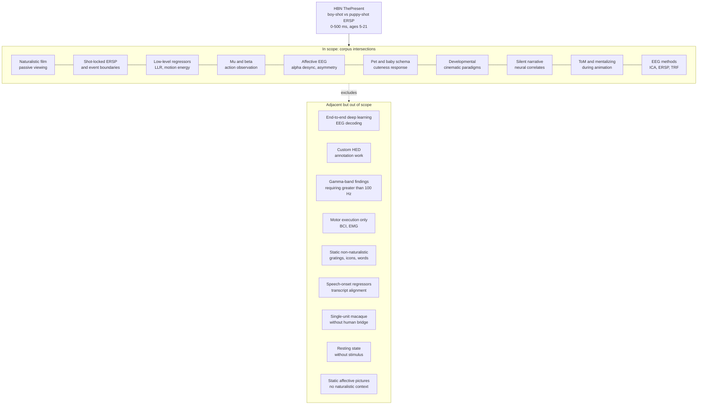

# Scope Diagram

A prose-plus-diagram statement of what the four-strand corpus covers and what it deliberately excludes. The diagram (Mermaid `flowchart TD`) shows in-scope intersections of the four strands that bear on the Healthy Brain Network electroencephalography (HBN-EEG) ThePresent boy-shot vs puppy-shot event-related spectral perturbation (ERSP) project, with adjacent topics that were explicitly placed out of scope by the per-strand briefs.

Abbreviations: event-related spectral perturbation (ERSP), inter-subject correlation (ISC), Hierarchical Event Descriptors (HED), event-related potential (ERP), generalized linear model (GLM), independent component analysis (ICA), magnetoencephalography (MEG), intracranial electroencephalography (iEEG), Healthy Brain Network (HBN).

## In scope

- **Naturalistic-film electrophysiology** with passive viewing, free of explicit task structure, anchored by [hasson-2010-natural-stimulation](../collection/action/hasson-2010-natural-stimulation/card.md) and the ISC family.
- **Shot-locked event-related responses** (ERSP and event-related potential (ERP)) at 0-500 ms post-onset, scaffolded by event-segmentation theory ([zacks-2007-event-segmentation](../collection/action/zacks-2007-event-segmentation/card.md), [baldassano-2017-event-boundaries](../collection/action/baldassano-2017-event-boundaries/card.md)) and intracranial-EEG film-cut work ([nentwich-2023-semantic-novelty-cuts](../collection/psychophysics/nentwich-2023-semantic-novelty-cuts/card.md)).
- **Low-level continuous regressors** for naturalistic stimuli, especially log luminance ratio (LLR) and motion energy, from the psychophysics strand ([adelson-bergen-1985-spatiotemporal-energy](../collection/psychophysics/adelson-bergen-1985-spatiotemporal-energy/card.md), [bartels-zeki-2008-natural-vision-mt](../collection/psychophysics/bartels-zeki-2008-natural-vision-mt/card.md), [carandini-heeger-2011-normalization](../collection/psychophysics/carandini-heeger-2011-normalization/card.md)).
- **Mu-band and beta-band sensorimotor signatures** of action observation ([hari-1998-mep-action-observation](../collection/action/hari-1998-mep-action-observation/card.md), [pineda-2005-mu-rhythm-mirror](../collection/action/pineda-2005-mu-rhythm-mirror/card.md), [oberman-2006-mu-mirror-autism](../collection/action/oberman-2006-mu-mirror-autism/card.md)).
- **Affective dynamics during cinematic stimuli** at the band-limited spectral level, especially alpha desynchronization for emotional content ([schubring-schupp-2023-alpha-emotion](../collection/emotion/schubring-schupp-2023-alpha-emotion/card.md), [nummenmaa-2012-emotion-synchrony](../collection/emotion/nummenmaa-2012-emotion-synchrony/card.md)).
- **Pet- and animal-evoked affective response** through baby-schema and pet-bonding ([stoeckel-2014-mother-child-dog](../collection/emotion/stoeckel-2014-mother-child-dog/card.md), [glocker-2009-baby-schema](../collection/emotion/glocker-2009-baby-schema/card.md), [borgi-2014-baby-schema-children](../collection/emotion/borgi-2014-baby-schema-children/card.md)).
- **Developmental neuroimaging in cinematic paradigms**, especially Pixar-style shorts in children ([richardson-saxe-2018-social-brain-development](../collection/emotion/richardson-saxe-2018-social-brain-development/card.md), [petroni-cohen-2018-isc-naturalistic-videos](../collection/emotion/petroni-cohen-2018-isc-naturalistic-videos/card.md)).
- **Silent-stimulus narrative neural correlates**, where speech-driven regressors do not apply ([castelli-2000-animations-mentalising](../collection/language/castelli-2000-animations-mentalising/card.md), [vanderwal-2015-inscapes](../collection/language/vanderwal-2015-inscapes/card.md), [naci-2014-suspenseful-movie](../collection/language/naci-2014-suspenseful-movie/card.md), [lankinen-2014-meg-movie-consistency](../collection/language/lankinen-2014-meg-movie-consistency/card.md)).
- **Theory of mind and mentalizing networks** as activated by character-animation viewing ([castelli-2000-heider-simmel](../collection/action/castelli-2000-heider-simmel/card.md), [richardson-saxe-2018-social-brain-development](../collection/emotion/richardson-saxe-2018-social-brain-development/card.md), [saxe-kanwisher-2003-tpj-tom](../collection/emotion/saxe-kanwisher-2003-tpj-tom/card.md)).
- **Methodological tooling for EEG ICA, ERSP, and TRF analysis** ([crosse-2016-mtrf-toolbox](../collection/psychophysics/crosse-2016-mtrf-toolbox/card.md), [dimigen-ehinger-2021-deconvolution-eye-eeg](../collection/psychophysics/dimigen-ehinger-2021-deconvolution-eye-eeg/card.md), [ploechl-2012-eye-eeg-artifact-correction](../collection/psychophysics/ploechl-2012-eye-eeg-artifact-correction/card.md)).

## Adjacent but out of scope

- **Deep learning end-to-end EEG decoding**: explicitly out of scope per `project_brief.md` ("No deep learning in Phase 1-6") and per the constraint that ThePresent uses a classical EEGLAB pipeline. The corpus includes deep-CNN visual-cortex modeling ([khaligh-razavi-kriegeskorte-2014-deep-cnn-it](../collection/psychophysics/khaligh-razavi-kriegeskorte-2014-deep-cnn-it/card.md), [kummerer-2016-deepgaze-ii](../collection/psychophysics/kummerer-2016-deepgaze-ii/card.md), [kragel-2019-emonet-visual](../collection/emotion/kragel-2019-emonet-visual/card.md)) as comparators, not as analysis targets.
- **Custom Hierarchical Event Descriptors (HED) work**: explicitly out of scope per `project_brief.md` ("No custom HED work in this project; use the events as-provided").
- **Gamma-band findings that require sampling rates above 100 Hz**: explicitly out of scope per the strand-psychophysics brief, except as comparator material for the future 500 Hz validation pass. Cards in the corpus that report gamma findings (e.g., [senkowski-2008-crossmodal-coherence](../collection/language/senkowski-2008-crossmodal-coherence/card.md)) are flagged as boundary cases.
- **Motor-execution-only paradigms**: out of scope per the strand-action brief. The mirror-system literature is included, but pure go/no-go reaching, isolated muscle EEG, and brain-computer interface motor-decoding are not.
- **Non-naturalistic isolated-stimulus paradigms**: out of scope across all four briefs. Static gratings, isolated icons, single-word reading, and resting EEG are excluded except where they bridge directly to dynamic naturalistic stimuli.
- **Speech-onset and transcript-aligned regressors**: out of scope for ThePresent because the stimulus is silent. The language-strand brief identifies categories 5 and 6 (silent-film, language models as regressors) as boundary cases that explicitly mark what cannot transfer.
- **Single-unit macaque physiology** unless it directly motivates a human EEG or fMRI claim used in Phase 3 (per the strand-action brief). [sliwa-2017-macaque-social-network](../collection/action/sliwa-2017-macaque-social-network/card.md) is included on this bridging logic.
- **Static-image affective neuroscience and IAPS-style picture viewing without naturalistic context**: out of scope per the strand-emotion brief except as methodological precedent for alpha-band ERSP.
- **Adult-only paradigms without a developmental bridging argument**: not strictly out of scope but each card carries a developmental-justification note.
- **Pure functional connectivity at rest or under non-stimulus conditions**: out of scope across briefs; resting-state EEG and resting fMRI appear only as comparator points (e.g., [vanderwal-2015-inscapes](../collection/language/vanderwal-2015-inscapes/card.md) explicitly contrasts Inscapes against rest).
- **Reading-only N400 work disconnected from auditory or audiovisual paradigms**: out of scope per the strand-language brief; included only as boundary citations ([delong-2005-n400-prediction](../collection/language/delong-2005-n400-prediction/card.md) listed but flagged as low relevance, and [kutas-2011-n400-review](../collection/language/kutas-2011-n400-review/card.md)).
- **Bilingual switching, phonological-articulatory motor speech, and clinical mood-disorder studies unrelated to film paradigms**: out of scope per the language and emotion briefs.

## Boundaries diagram

## Notes on the diagram

The in-scope cluster contains ten nodes representing the cross-strand intersections most relevant to ThePresent. Each node corresponds to a theme in `science-map.md` (Themes 1, 2, 3, 4, 5, 6, 7, 8, 11, 12, 13). The out-of-scope cluster contains nine nodes representing topics explicitly excluded by the four briefs and by `project_brief.md`. The dashed edge from the in-scope cluster to the out-of-scope cluster denotes "explicitly excludes". The chain of solid edges among the in-scope nodes is illustrative connective tissue, not a claim of pairwise dependency; the actual cross-references are spelled out in the science-map.

The total node count is 20, well under the 30-node ceiling stated in the synthesis-templates reference.
